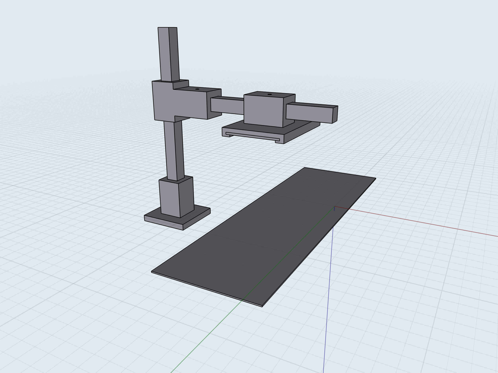
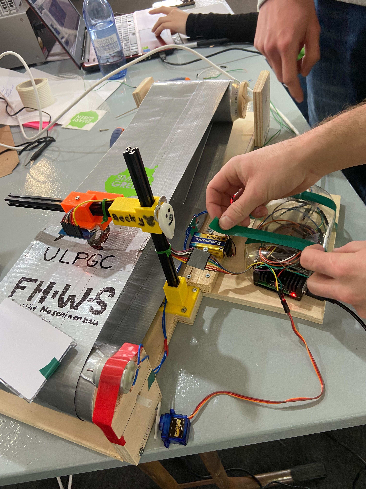

# meta-waste
Enhancing waste with metadata 🗑️

<details>
<summary>Table of content</summary>

- [about](#about)
  - [solution](#solution)
    - [evaluation](#evaluation)
  - [assumptions](#assumptions)
- [presentation](#presentation)
- [team members](#team-members)
</details>

## about
Recyclers and consumers don't have definite information about the packaging/ waste they are dealing with.

### solution
We attach rfid-chips to packaging and store metainformation on it. Metainformation is e.g. `oem`, `used energy`, `material mix`, ...




The possibility to cryptographically sign the data is also implemented. Datastructure looks like:
```js
{
    payload: {
        OEM: "itq",
        energy_W: 12,
    },
    signature: "Ph0\xf3\xfe\x12\[...]\x88\xf9>\x8d>7i(\xea\xd4\x0c\xfbD\xe3\xe0"
}
```

#### evaluation
**PRO** <br/>
This is useful for consumers and recyclers:
* Consumers – use this information to make better shopping decisions
* Recycler – use this information to reuse the material in a better way <br/>
    --> advantage is that recyclers don't need to guess the material mix. but can access the exact information from the waste

**CON** <br/>
The current approach of using rfid-chips has the problem that it actually produces a lot of additional waste... . There are alternatives like QR-codes, UV-ink, print-embedded-patterns etc.

### assumptions
* there is a mean to effectively store store metainformation on waste
* recyclers are able to read this information for each individual piece of waste

## presentation
You can find the presentation [here](garbage-team-presentation.pdf)

## team members
| github handle                               | responsibility               |
| :------------------------------------------ | :--------------------------- |
| Andrea                                      | hardware design + assembling |
| [m-lukas](https://github.com/m-lukas)       | electrical engineering       |
| Natalia                                     | presentation, design         |
| [simonheu](https://github.com/simonheu)     | hardware design + assembling |
| [Urhengulas](https://github.com/Urhengulas) | rfid, cryptography           |

